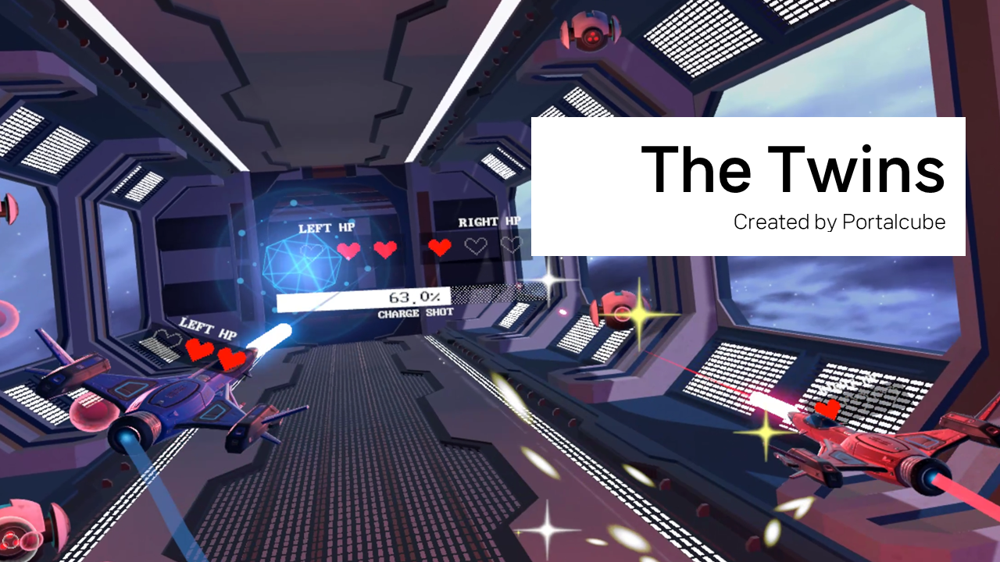
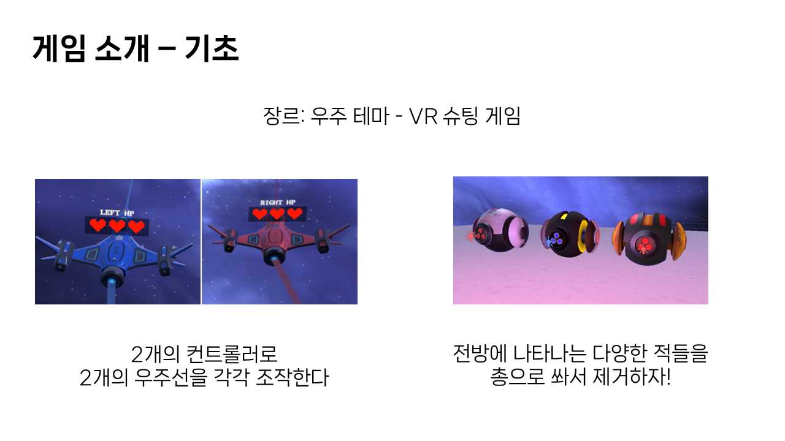
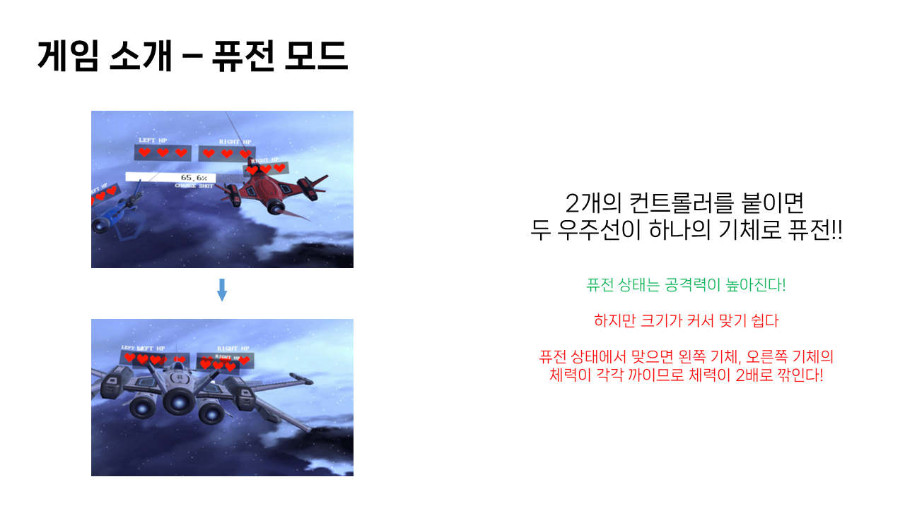
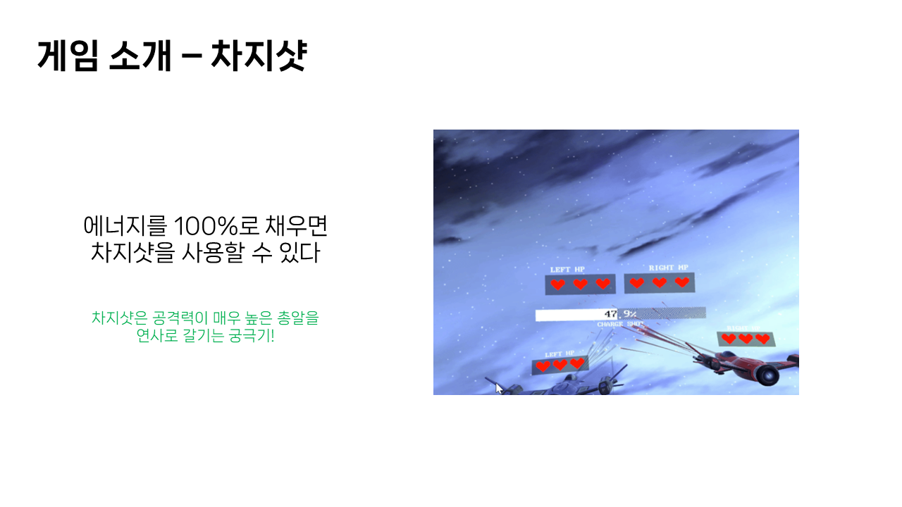
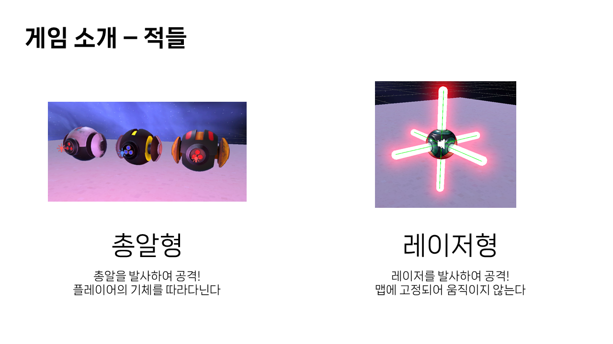
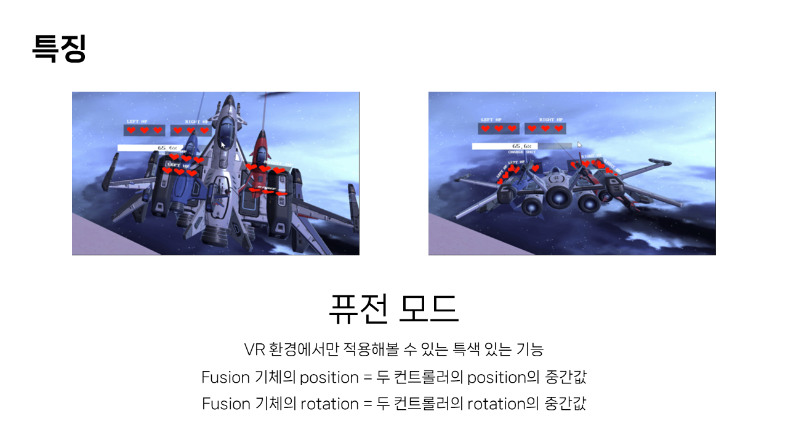
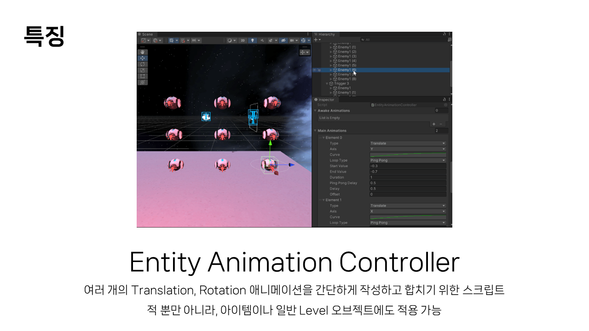
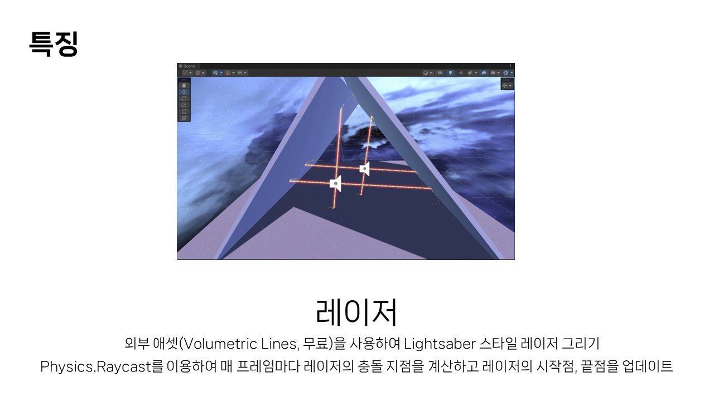
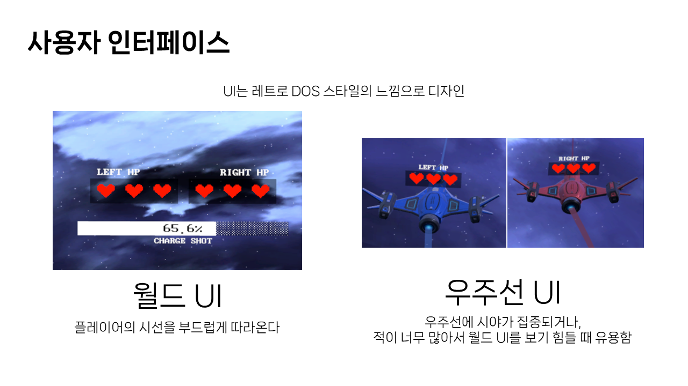
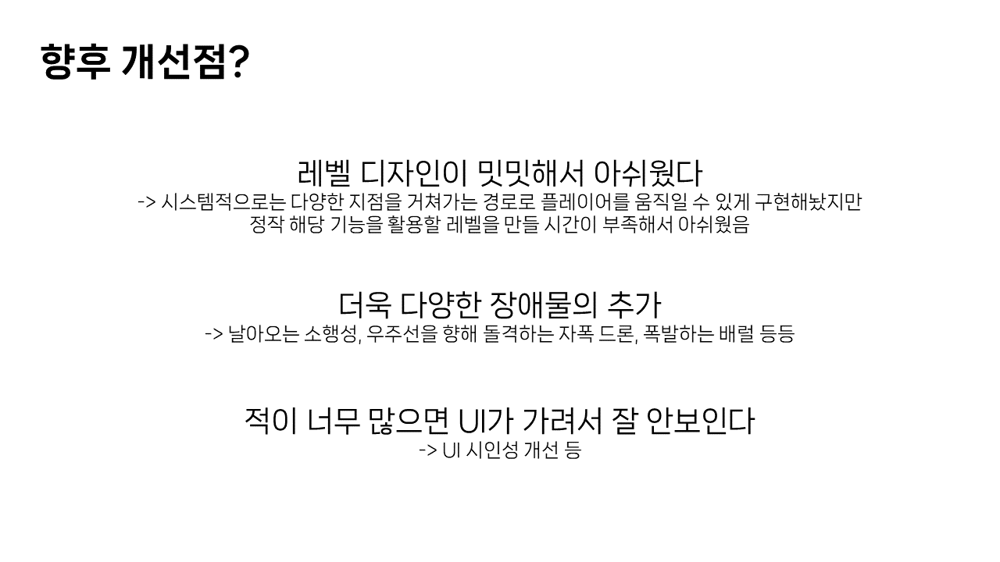

# The Twins
가상현실과증강현실 수업의 중간 프로젝트로 개발한 게임, "The Twins" 입니다.

-   제작 기간: 2024년 4월 25일 ~ 29일
-   장르: VR 슈팅 탄막 게임
-   플랫폼: Windows & Meta Quest

## 시연 동영상

#### [유튜브 영상 보러가기](https://youtu.be/rnN4t309V10)

## 프로젝트 소개

## 기타

-   본 레포지토리는 외부 애셋을 제외하고 업로드하였습니다. 빌드가 불가능할 수 있습니다.
